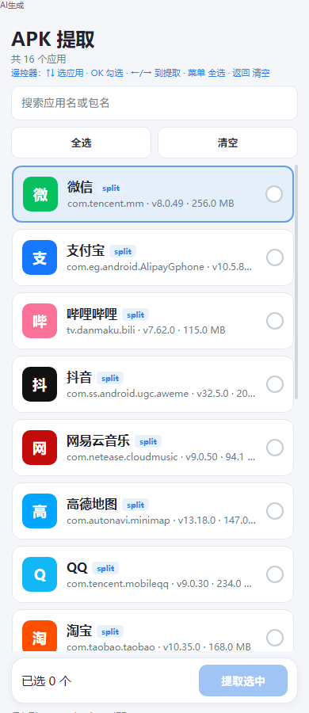
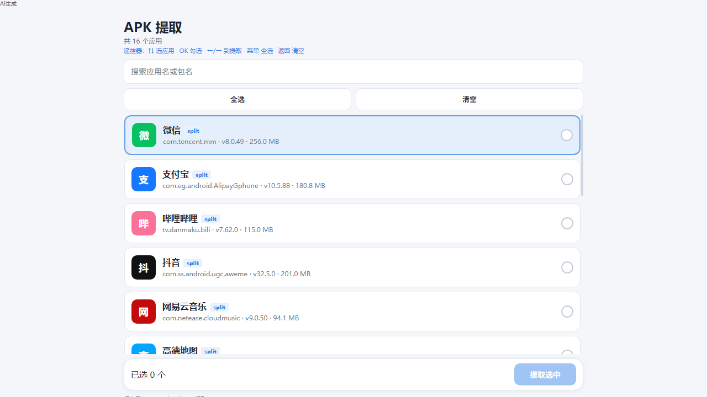

<div align="center">


# APK Backup · APK 提取

**Extract installed apps. Backup every APK.**

A lightweight Android utility that lists installed apps and exports APK files to local storage.  
One install for **phones** and **Android TV**.

<br />


[Download](https://github.com/alguojian/apk-backup/releases/latest) · [中文说明](README.zh-CN.md) · [Report Issue](https://github.com/alguojian/apk-backup/issues)

<br />

<p align="center">
  
  &nbsp;&nbsp;
  
</p>
<p align="center">
  
</p>

*Real app UI · Multi-select · Phone & TV · Files saved to `Download/APK提取/`*

</div>

---

## Built for phone and TV

Work phone, living-room TV, or TV box — the same APK is designed for both.  
Large list rows, clear remote focus, and one-tap multi-select work with touch **and** D-pad.

- Phone home screen: shows as **APK 提取**
- Android TV launcher: same package, leanback-ready
- Remote-first controls, also fine with fingers

## Features

- **List installed apps** — name, package, version, size at a glance
- **Search** — filter by app name or package name
- **Multi-select** — tap anywhere on a row to toggle; select all / clear in one tap
- **Export APK** — copy to local storage in seconds
- **Split APK support** — base + splits exported as separate files
- **Light UI** — soft background, rounded action card, readable on TV

## Where files go

Extracted packages are saved to:

```text
Download/APK提取/
```

Example:

```text
/storage/emulated/0/Download/APK提取/com.tencent.mm-v8.0.49.apk
```

## Install

Grab `tiqu-release-*.apk` from [Releases](https://github.com/alguojian/apk-backup/releases), then sideload it.

| Device | How |
| --- | --- |
| Phone | Copy the APK, allow unknown sources, install |
| Android TV / Box | USB drive, LAN transfer, or `adb install -r xxx.apk` |

> One APK covers phone and TV. No separate builds.

## Remote control (TV)

| Key | Action |
| --- | --- |
| ↑ ↓ | Move focus |
| OK / Enter | Select or deselect |
| ← → | Jump to **Extract** (when something is selected) |
| Menu | Select all |
| Back | Clear selection → clear search → exit |
| F1 / Green (some remotes) | Extract now |

## Permissions

| Permission | Why | When |
| --- | --- | --- |
| `QUERY_ALL_PACKAGES` | List installed apps | Declared at install (required on Android 11+) |
| `WRITE_EXTERNAL_STORAGE` | Write to public Downloads | **Android 9 and below only** (runtime prompt) |

Android 10+ uses MediaStore — **no storage permission** needed.

## Build from source

Requirements: **JDK 17+**, Android SDK (compileSdk 36)

```bash
# Debug
./gradlew :app:assembleDebug

# Release (needs keystore.properties + signing/*.jks)
./gradlew :app:assembleRelease
```

Output: `app/build/outputs/apk/`

## Project layout

```text
app/src/main/java/com/tiqu/extractor/
  MainActivity.java      # UI, remote keys, loading & refresh
  AppListAdapter.java    # list + full-row toggle
  ApkExtractor.java      # scan apps, copy APK files
  AppEntry.java          # list model
index.html               # UI preview (keyboard = remote)
docs/screenshots/        # README screenshots
```

## Preview without installing

Open `index.html` in a browser. Keyboard maps to a TV remote:

↑ ↓ move · Enter select · ← → extract · F1 select all · Esc clear

---

## License

[MIT](LICENSE) © tiqu
