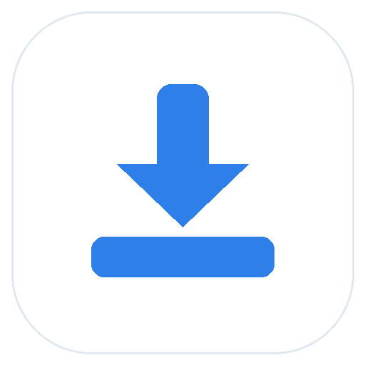
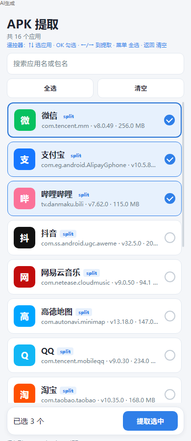

<div align="center">



# APK Backup · APK 提取

**提取本机应用，备份每一个 APK。**

轻量 Android 小工具：列出已安装应用，一键导出 APK 到本地。  
**手机** 与 **电视** 共用同一个安装包。

<br />


[下载](https://github.com/alguojian/apk-backup/releases/latest) · [English](README.md) · [反馈问题](https://github.com/alguojian/apk-backup/issues)

<br />



*真实应用界面 · 支持多选 · 文件保存到 `Download/APK提取/`*

</div>

---

## 为手机和电视而设计

工作手机、客厅电视、电视盒子，都能用同一套安装包。  
大号列表、清晰的遥控焦点、整条点击多选——触屏和方向键都顺手。

- 手机桌面：显示为 **APK 提取**
- 电视桌面：同一包，支持 Leanback 启动
- 以遥控器操作优先，手指点按同样好用

## 功能特性

- **列出已安装应用** — 名称、包名、版本、大小一目了然
- **搜索** — 按应用名或包名过滤
- **多选** — 整条任意位置点击切换；一键全选 / 清空
- **导出 APK** — 快速复制到本地存储
- **支持 split APK** — 导出为 base + split 多个文件
- **浅色界面** — 柔和背景、底部圆角卡片，电视上也清晰

## 提取目录

提取出的文件保存在：

```text
Download/APK提取/
```

完整路径示例：

```text
/storage/emulated/0/Download/APK提取/com.tencent.mm-v8.0.49.apk
```

## 安装

从 [Releases](https://github.com/alguojian/apk-backup/releases) 下载 `tiqu-release-*.apk` 后安装。

| 设备 | 方法 |
| --- | --- |
| 手机 | 传输 APK，允许未知来源后安装 |
| 电视 / 盒子 | U 盘、局域网传输，或 `adb install -r xxx.apk` |

> 手机端与电视端是同一个安装包，无需分别下载。

## 电视遥控器操作

| 按键 | 作用 |
| --- | --- |
| ↑ ↓ | 移动焦点 |
| OK / 确认 | 勾选 / 取消当前应用 |
| ← → | 有勾选时跳到 **提取选中** |
| 菜单键 | 全选 |
| 返回 | 先清勾选 → 再清搜索 → 退出 |
| F1 / 绿色键（部分遥控） | 直接开始提取 |

## 权限说明

| 权限 | 用途 | 时机 |
| --- | --- | --- |
| `QUERY_ALL_PACKAGES` | 列出全部已安装应用 | 安装时声明（Android 11+ 必需） |
| `WRITE_EXTERNAL_STORAGE` | 写入公共下载目录 | **仅 Android 9 及以下** 运行时申请 |

Android 10+ 通过 MediaStore 写入下载目录，**不需要**存储权限。

## 从源码构建

需要 **JDK 17+**、Android SDK（compileSdk 36）

```powershell
# 调试包
.\gradlew.bat :app:assembleDebug

# 生产签名包（需要 keystore.properties + signing/*.jks）
.\gradlew.bat :app:assembleRelease
```

产物在 `app/build/outputs/apk/`。

## 工程结构

```text
app/src/main/java/com/tiqu/extractor/
  MainActivity.java      # 主界面、遥控按键、加载刷新
  AppListAdapter.java    # 列表与整条点击勾选
  ApkExtractor.java      # 扫描应用并复制 APK
  AppEntry.java          # 列表数据模型
index.html               # 界面预览（键盘模拟遥控）
docs/screenshots/        # README 截图
```

## 无需安装即可预览

用浏览器打开 `index.html`，键盘可模拟电视遥控：

↑ ↓ 移动 · Enter 勾选 · ← → 提取 · F1 全选 · Esc 清空

---

## 开源协议

[MIT](LICENSE) © tiqu
